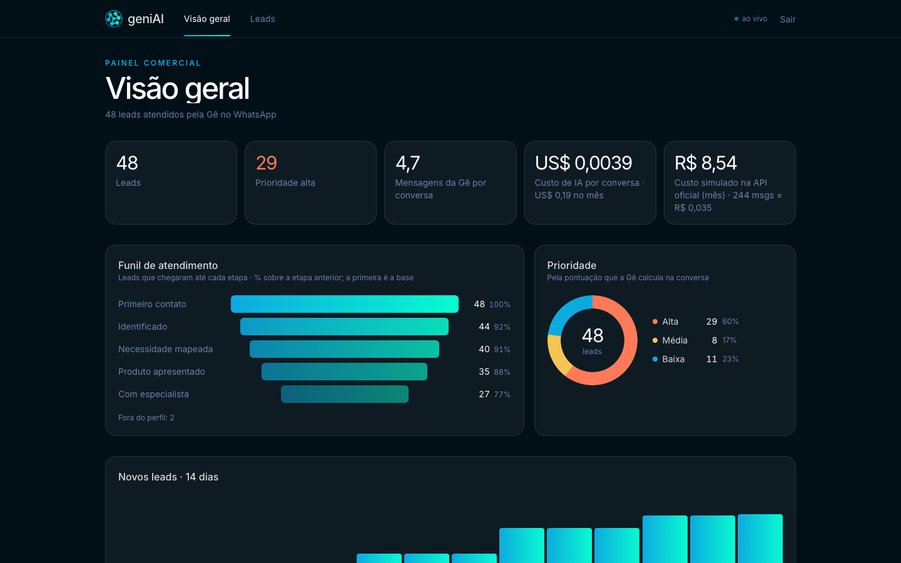
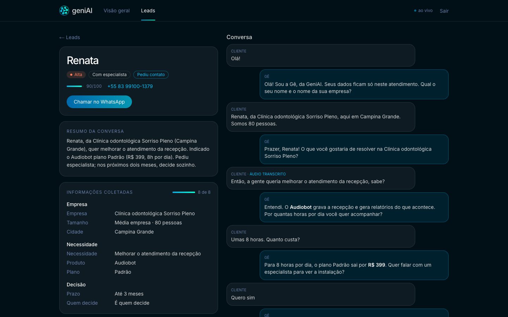
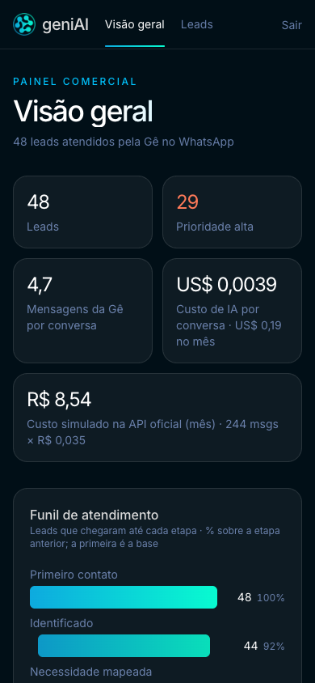

# geniai-agente

[](https://github.com/dv-dev1/geniai-agente/actions/workflows/ci.yml)
[](https://github.com/dv-dev1/geniai-agente/actions/workflows/avaliar.yml)

A Gê é a assistente de pré-vendas da GeniAI no WhatsApp. Ela entende texto e áudio, faz a triagem, apresenta o Audiobot ou o Disparador com o preço real e passa o lead para um especialista em poucas mensagens.
Um painel ao vivo mostra o funil, a prioridade dos leads, o custo de IA por conversa e a conversa de cada um, com um botão para chamar o lead no WhatsApp.







## Arquitetura

```
WhatsApp ─ Z-API ─ webhook ─▶ web/ (Next.js 16, Vercel)
                              ├─ acorda o cérebro e espera 6 s o cliente parar de digitar; responde uma vez
                              ├─ áudio: POST /transcrever (gpt-4o-mini-transcribe) enquanto espera
                              ├─ sessão de 30 min; atendente no celular pausa o bot por 24 h
                              ├─ Postgres Neon: contatos, mensagens (com o custo de IA de cada uma), lead
                              └─ POST /responder ─▶ cerebro/ (FastAPI + LangGraph, Vercel)
                                                    agente (gpt-4.1-mini, saída estruturada)
                                                      → conferir: preço só da base, despedida sem pergunta,
                                                        até 300 caracteres; se falhar, a Gê reescreve uma vez
                                                      → qualificar (pontuação em código)
```

O cérebro não guarda estado: recebe o histórico da sessão e o lead, e devolve a mensagem, o lead atualizado, a pontuação, a ação e o custo.

## A Gê em 6 conversas simuladas

`cd cerebro && uv run --env-file .env python -m agente.avaliar` põe o próprio gpt-4.1-mini no papel de 6 clientes. Cada conversa só passa com até 7 mensagens do bot, a temperatura esperada, mensagens de até 300 caracteres sem menu numerado, nenhum preço fora da base e, quando encaminha, uma despedida sem pergunta. Roda também no GitHub Actions (workflow `avaliar`), com a tabela no resumo do job:

```
persona               msgs  temperatura       acao                custo US$
MEI curiosa           4     frio (frio)       encerrar            0.0029  ok
Restaurante           5     quente (quente)   encaminhar_humano   0.0042  ok
Gerente de varejo     4     morno (morno)     encerrar            0.0031  ok
Candidato a vaga      2     frio (frio)       encerrar            0.0013  ok
Só quer preço         5     quente (quente)   encaminhar_humano   0.0041  ok
Distribuidora decidida4     quente (quente)   encaminhar_humano   0.0032  ok

custo total US$ 0.0188 · média por conversa US$ 0.0031
```

## Rodar local

```bash
cd cerebro && uv sync --extra dev && uv run pytest
uv run --env-file .env python -m agente.chat            # conversa com a Gê no terminal

cd web && npm ci && vercel env pull .env.local && npm test
npm run dev                                              # dashboard em localhost:3000; login em /login (sessão JWT de 7 dias, AUTH_SECRET no .env.local)
```

## Z-API

Depois do deploy, aponte o webhook de mensagens recebidas e ligue o aviso das mensagens enviadas pelo celular, que é o que tira o bot da conversa quando um atendente responde:

```bash
cd web && set -a && source .env.local && set +a
BASE="https://api.z-api.io/instances/$ZAPI_INSTANCE_ID/token/$ZAPI_TOKEN"
curl -s -X PUT "$BASE/update-webhook-received" -H "Client-Token: $ZAPI_CLIENT_TOKEN" -H 'Content-Type: application/json' \
  -d "{\"value\":\"https://geniai-web.vercel.app/api/webhook/$WEBHOOK_SECRET\"}"
curl -s -X PUT "$BASE/update-notify-sent-by-me" -H "Client-Token: $ZAPI_CLIENT_TOKEN" -H 'Content-Type: application/json' \
  -d '{"notifySentByMe":true}'
```

## De onde vem o que a Gê diz

Tudo sai de [`docs/respostas-geniai.md`](docs/respostas-geniai.md), resumido em [`cerebro/kb/`](cerebro/kb/), que entra inteiro no prompt. Falta confirmar com a GeniAI:

- de quanto em quanto tempo os planos do Audiobot são cobrados;
- o corte de base relevante do Disparador (`BASE_RELEVANTE = 500` em `cerebro/agente/lead.py`);
- o plano da Vercel: o Hobby serve para demo, e uso comercial pede o Pro.

Desenho e decisões em [`specs/`](specs/).

## Autor

Feito por [dv-dev1](https://github.com/dv-dev1) · [LinkedIn](https://www.linkedin.com/in/dv-dev/).
